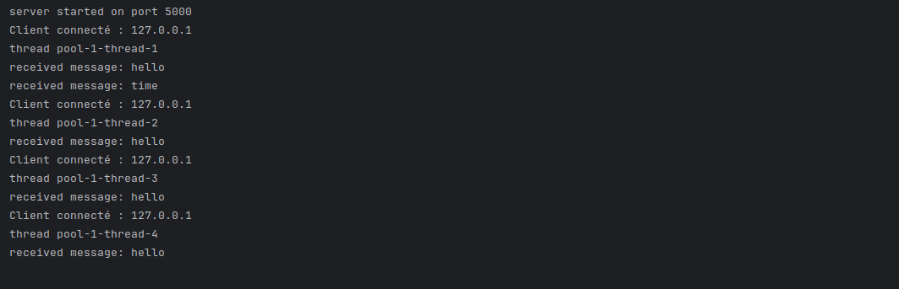

# java-tcp-server
# MultiThreadServer

A simple multi-threaded TCP server in Java that accepts client connections and responds to text-based commands.

---

## How It Works

### `MultiThreadServer`
- Opens a `ServerSocket` on port **5000**
- Runs an infinite loop waiting for incoming TCP connections
- Each new connection is handed off to a **fixed thread pool of 5 threads** (`ExecutorService`)
- This allows up to 5 clients to be handled concurrently without blocking the main accept loop

### `ClientHandler`
- Implements `Runnable` — runs on one of the pool threads
- Reads **one line** from the client using `BufferedReader`
- Responds based on the message content:

| Client sends | Server responds |
|---|---|
| `hello` | `Bonjour client !` |
| `time` | Current date and time |
| `bye` | Closes the connection |
| anything else | Echoes back `Message reçu : <message>` |

---

## Limitations

- **Reads only one message per connection** — after handling the first message the handler exits (except for `bye` which explicitly closes). The connection is not kept alive for further messages.
- **Thread pool is fixed at 5** — a 6th concurrent client will wait until a thread is free.
- **No framing protocol** — messages are delimited by newline (`\n`), so clients must send line-terminated strings.
- **No reconnection or retry logic** — if the socket breaks mid-read, a `RuntimeException` is thrown.

---

## How to Test

Connect using `telnet` or `nc`:

```bash
# Using telnet
telnet 127.0.0.1 5000

# Using netcat
nc 127.0.0.1 5000
```

Then type any supported command and press **Enter**:

```
hello        → Bonjour client !
time         → time is 2024-01-15T10:30:00.123
bye          → (connection closed)
anything     → Message reçu : anything
```

---

## Project Structure

```
src/
├── org/example/server/
│   └── MultiThreadServer.java   # Entry point, accepts connections
└── org/example/client/
    └── ClientHandler.java       # Handles each client in a separate thread
```


